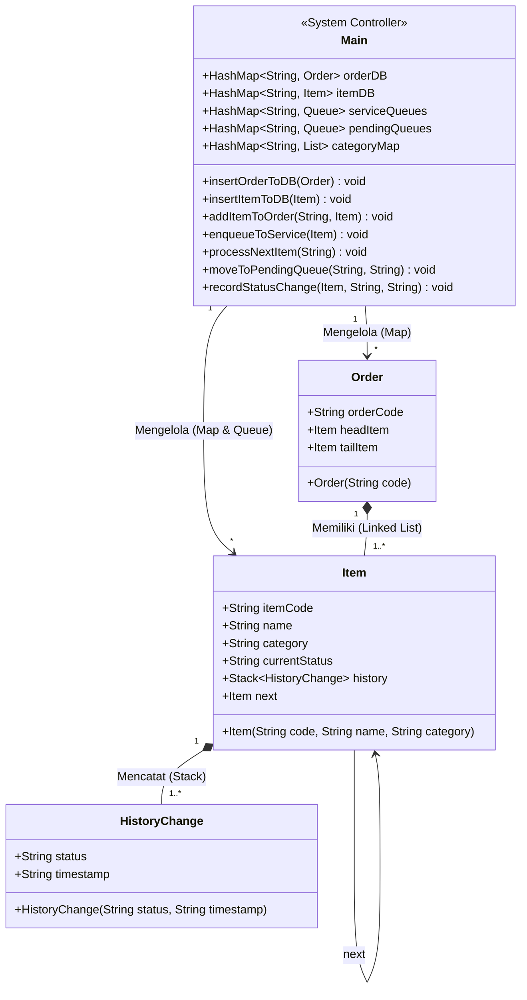

```mermaid
classDiagram
    %% Menentukan Kelas Main (Sistem Pusat)
    class Main {
        <<System Controller>>
        +HashMap~String, Order~ orderDB
        +HashMap~String, Item~ itemDB
        +HashMap~String, Queue~ serviceQueues
        +HashMap~String, Queue~ pendingQueues
        +HashMap~String, List~ categoryMap
        +insertOrderToDB(Order) void
        +insertItemToDB(Item) void
        +addItemToOrder(String, Item) void
        +enqueueToService(Item) void
        +processNextItem(String) void
        +moveToPendingQueue(String, String) void
        +recordStatusChange(Item, String, String) void
    }

    %% Menentukan Kelas Order
    class Order {
        +String orderCode
        +Item headItem
        +Item tailItem
        +Order(String code)
    }

    %% Menentukan Kelas Item
    class Item {
        +String itemCode
        +String name
        +String category
        +String currentStatus
        +Stack~HistoryChange~ history
        +Item next
        +Item(String code, String name, String category)
    }

    %% Menentukan Kelas HistoryChange
    class HistoryChange {
        +String status
        +String timestamp
        +HistoryChange(String status, String timestamp)
    }

    %% Relasi Antar Kelas
    Main "1" --> "*" Order : Mengelola (Map)
    Main "1" --> "*" Item : Mengelola (Map & Queue)
    Order "1" *-- "1..*" Item : Memiliki (Linked List)
    Item "1" *-- "1..*" HistoryChange : Mencatat (Stack)
    Item --> Item : next
```